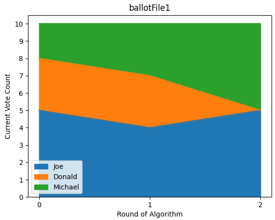
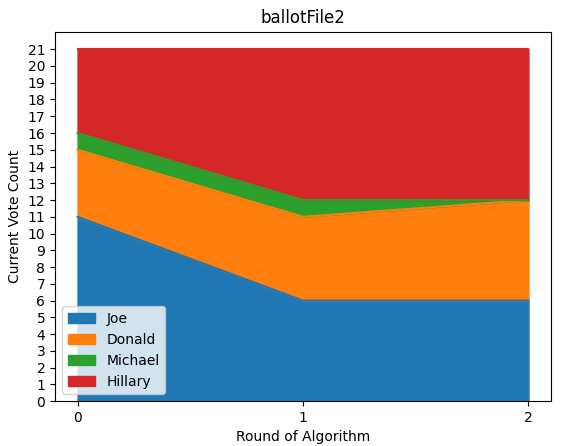
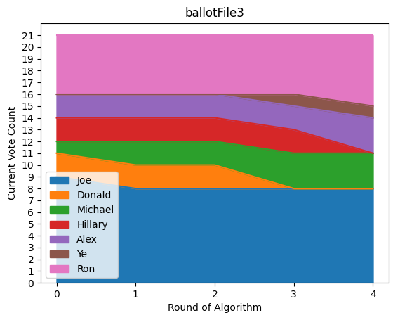

# Instant Runoff Voting Algorithm

Instead of forcing constituents to select only one out of many candidates, the IRV algorithm allows each voter to rank each candidate from best to worst. You've probably heard the phrase "If you don't vote for candidate_X, you are effectively voting for candidate_Y." IRV elections provide an elegant solution to this argument, allowing voters to more completely express their voices.

## Executing Algorithm

Run MainApplication to execute the algorithm on the ballotFile specified on line 9 of `MainApplication.kt`. You can modify this string to specify which ballotFile is run.

## Collecting Votes

* Modify the ballotFile csv files directly following the guide in `ballotFiles/ballotFileGuide.csv` or:
* Run CollectVotes to start the Spring Boot server on `port 8091` (configurable in `application.properties`) and navigate to [http://localhost:8091](http://localhost:8091) in your browser of choice, to cast votes. 
* You must set up [port forwarding](https://www.hellotech.com/guide/for/how-to-port-forward) to allow other iot devices to access the server and cast votes.

## Example Results

Run `python3 visualization.py` to generate a graph of the distribution of votes as each round of the algorithm progresses. Modify the string on line 6 of `visualization.py` to run a different outputFile.

### Visualization Requirements

* [Numpy](https://numpy.org)
* [Pandas](https://pypi.org/project/pandas/)
* [Matplotlib](https://matplotlib.org)

## Notes
* The values used to generate the graphs are written in `graphFiles/`
* A more readable version of the results is written in `outputFiles/` and to the terminal
* For the [Stacked Area Charts](https://www.python-graph-gallery.com/stacked-area-plot/#:~:text=A%20stacked%20area%20chart%20displays,read%20each%20group%20value%20accurately.) below:
  * The Y-Axis represents the number of ballots belonging to each candidate in that particular round
  * The X-Axis represents the round of the algorithm as it is executed.
  * The 0 column round is the initial distribution of ballots all based on first choices

* Once a loser is declared for a round, all the ballots they held are redistributed to the next candidate preference on each individual ballot.
* Similarly, once a winner is declared, their excess votes (votes above the current quota required to be declared a winner) are redistributed to the next candidate preference of each individual ballot.
* Running the same ballotFiles will result in different graphs and even different winners due to the shuffling step on line 59 of `ElectionIRV.kt` Commenting out this line will result in consistent results.

## Learn more about Instant Runoff Voting

* [IRV-wikipedia](https://en.wikipedia.org/wiki/Instant-runoff_voting#:~:text=If%20a%20candidate%20has%20moretotals%20of%20their%20next%20choice.)
* [https://www.youtube.com/watch?v=6axH6pcuyhQ](https://www.youtube.com/watch?v=6axH6pcuyhQ)
* [https://fairvote.org/our-reforms/ranked-choice-voting/](https://fairvote.org/our-reforms/ranked-choice-voting/)